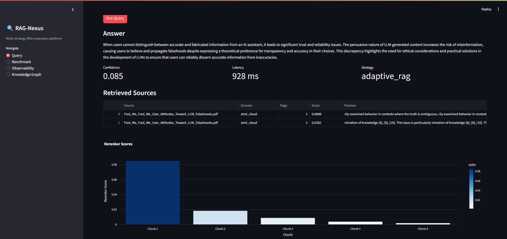
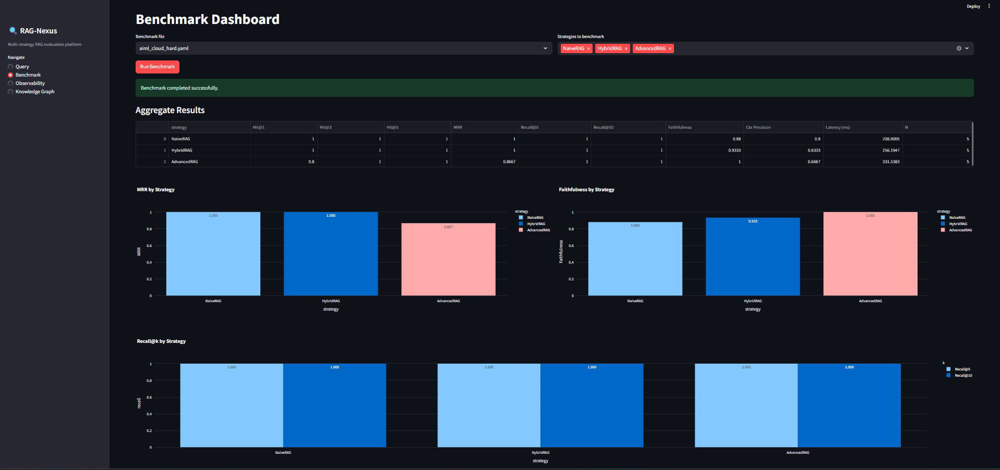
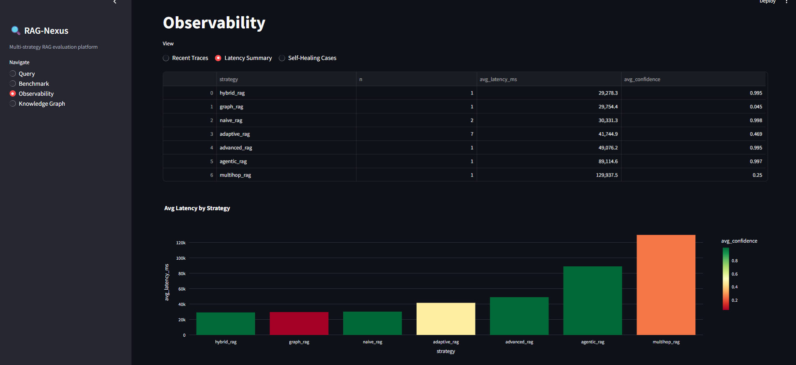
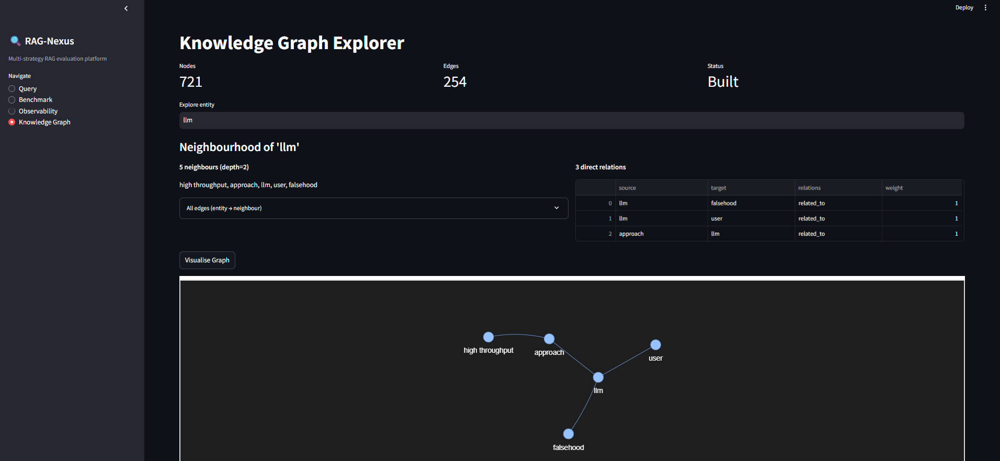

# RAG-Nexus-Multi-Strategy-RAG-Evaluation-Platform

[](https://github.com/AdithyaRaoK14/RAG-Nexus-Multi-Strategy-RAG-Evaluation-Platform/actions/workflows/ci.yml)
[](https://www.python.org/downloads/release/python-3110/)
[](LICENSE)
[](https://ollama.com/)
[](https://qdrant.tech/)
[](https://streamlit.io/)
[](https://fastapi.tiangolo.com/)

**A fully local, multi-strategy RAG evaluation and experimentation platform.**

8 retrieval strategies. Automatically constructed knowledge graph with entity extraction and graph-aware retrieval. Self-healing pipeline. MCP server. Zero external APIs.

---

## Screenshots

| Query Interface | Benchmark Dashboard |
|---|---|
|  |  |

| Observability Traces | Knowledge Graph Explorer |
|---|---|
|  |  |


---

## Knowledge Corpus

70 curated research papers across 7 domains:

| Domain | Papers | Best strategy |
|---|---|---|
| Squamous Cell Carcinoma | 10 | GraphRAG, Multi-hop |
| SQL Injection / Security | 10 | Hybrid RAG |
| RAG & Retrieval | 10 | Advanced RAG |
| Large Language Models | 10 | Advanced RAG |
| System Design & Distributed | 10 | Multi-hop, Agentic |
| DevOps & Infrastructure | 10 | Hybrid RAG |
| AI/ML & Cloud | 10 | Adaptive RAG |

---

## Strategies

| Strategy | Description |
|---|---|
| `naive_rag` | Dense vector search → rerank → generate. Benchmark anchor. |
| `hybrid_rag` | Dense (Qdrant) + BM25 + RRF fusion → rerank → generate. |
| `advanced_rag` | Query rewriting + HyDE + hybrid retrieval + contextual compression. |
| `graph_rag` | Auto-KG entity expansion → boosted retrieval → generate. |
| `adaptive_rag` | Classifies query type → routes to optimal strategy. |
| `multihop_rag` | Iterative sub-query retrieval via LangGraph until question is answered. |
| `agentic_rag` | ReAct agent that reasons and calls tools iteratively (LangGraph). |
| `healing_pipeline` | Cascades Hybrid → Advanced → GraphRAG until confidence threshold met. |

---

## Benchmark Results

Benchmarks were executed locally using curated evaluation datasets spanning medical, retrieval, security, and systems domains.

| Strategy        |     Hit@1 |     Hit@3 |     Hit@5 |       MRR | Faithfulness | Latency (ms) |
| --------------- | --------: | --------: | --------: | --------: | -----------: | -----------: |
| **MultihopRAG** | **0.657** | **0.886** | **0.914** | **0.764** |        0.912 |          633 |
| HybridRAG       |     0.629 |     0.857 |     0.857 |     0.733 |        0.920 |          246 |
| GraphRAG        |     0.629 |     0.857 |     0.857 |     0.733 |        0.909 |         4294 |
| NaiveRAG        |     0.629 |     0.857 |     0.857 |     0.729 |        0.921 |      **212** |
| AdaptiveRAG     |     0.571 |     0.829 |     0.829 |     0.686 |        0.930 |          413 |
| AgenticRAG      |     0.571 |     0.800 |     0.829 |     0.679 |        0.799 |          255 |
| HealingPipeline |     0.571 |     0.800 |     0.800 |     0.671 |        0.915 |          949 |
| AdvancedRAG     |     0.571 |     0.714 |     0.714 |     0.638 |    **0.946** |          322 |

**Key observations**

- **MultihopRAG** achieved the strongest retrieval performance across all benchmark datasets.
- **NaiveRAG** remained the fastest strategy while maintaining competitive accuracy.
- **AdvancedRAG** produced the highest faithfulness scores.
- **GraphRAG** improved retrieval for entity-centric queries but incurred higher latency due to knowledge graph traversal.
- **AdaptiveRAG** dynamically routed queries across strategies, balancing performance and efficiency.

> Run `python query.py --benchmark-all` to reproduce these results on your machine.

---

## Tech Stack

| Layer | Tools |
|---|---|
| LLMs | Ollama — Qwen2.5:3B, Phi3:mini, Llama3.2:3B |
| Embeddings | `BAAI/bge-base-en-v1.5` (768-dim) |
| Reranker | `cross-encoder/ms-marco-MiniLM-L-6-v2` |
| Vector store | Qdrant (local or Docker) |
| Sparse retrieval | BM25Okapi (rank-bm25) |
| Knowledge graph | NetworkX + Ollama-based triple extraction |
| Graph construction | Automatic entity extraction with pruning and provenance tracking |
| Orchestration | LangGraph (multihop, agentic, healing) |
| API | FastAPI |
| Dashboard | Streamlit + Plotly |
| Observability | SQLite traces |
| MCP | JSON-RPC 2.0 stdio server |
| CI | GitHub Actions |

---

## Installation

```bash
# 1. Clone and install
git clone https://github.com/AdithyaRaoK14/RAG-Nexus-Multi-Strategy-RAG-Evaluation-Platform.git
cd rag-nexus
pip install -r requirements.txt

# 2. Start Ollama and pull models
ollama serve
ollama pull qwen2.5:3b
ollama pull phi3:mini
ollama pull llama3.2:3b

# 3. Drop your PDFs into corpus/
# corpus/medical/scc/paper_01.pdf  etc.

# 4. Ingest documents and build all indices
python ingest.py --all --build-kg

# Rebuild only the knowledge graph
python ingest.py --kg-only

# Check index statistics
python ingest.py --stats
```

### Docker (Qdrant + Ollama + API)

```bash
docker compose up -d
# Then ingest via API: POST /ingest/corpus
```

---

## Usage

### CLI

```bash
# Single query (adaptive routing)
python query.py "What are the risk factors for SCC?"

# Choose strategy
python query.py "How does TP53 relate to SCC?" --strategy graph_rag

# Agentic RAG
python query.py "Compare SQL injection mitigation techniques" --strategy agentic_rag

# Compare 3 core strategies side-by-side
python query.py "What is consistent hashing?" --compare

# Compare 3 models on the same strategy
python query.py "Explain RRF fusion" --model-compare

# Run benchmark on a domain
python query.py --benchmark evaluation/benchmarks/medical.yaml

# Run all benchmarks
python query.py --benchmark-all

# Show full trace
python query.py "What is HyDE?" --trace
```

### REST API

```bash
uvicorn api.main:app --reload

# Query
curl -X POST http://localhost:8000/query/ \
  -H "Content-Type: application/json" \
  -d '{"query": "What is SQL injection?", "strategy": "hybrid_rag"}'

# Compare strategies
curl -X POST http://localhost:8000/query/compare \
  -d '{"query": "What is SCC?", "strategies": ["naive_rag", "hybrid_rag", "advanced_rag"]}'

# Index stats
curl http://localhost:8000/stats
```

### Streamlit Dashboard

```bash
streamlit run ui/app.py
```

### MCP Server

```bash
# Start the server (stdio transport, JSON-RPC 2.0)
python -m mcp.server

# Available tools:
#   rag_query           — query with any strategy
#   compare_strategies  — side-by-side comparison
#   run_benchmark       — evaluate against a YAML file
#   evaluation_report   — strategy latency summary
#   graph_query         — explore the knowledge graph
#   strategy_explain    — explain how a strategy works
```

---

## Project Structure

```
rag-nexus/
├── core/               # Embedder, Generator, Retriever, Reranker, Schema
├── ingestion/          # Loaders, Chunkers, Indexers
├── strategies/         # 8 RAG strategies
├── knowledge_graph/    # Entity extractor (Ollama) + NetworkX store
├── evaluation/         # Metrics, BenchmarkRunner, YAML files
├── observability/      # SQLite tracer
├── mcp/                # JSON-RPC 2.0 stdio server + tools
├── api/                # FastAPI REST API
├── ui/                 # Streamlit dashboard
├── screenshots/        # Place your screenshots here
├── corpus/             # Drop PDFs here (gitignored)
├── data/               # Runtime: Qdrant index, BM25, KG (gitignored)
├── config.yaml         # All configuration
├── ingest.py           # Ingestion CLI
└── query.py            # Query + benchmark CLI
```

---

## Configuration

All settings in `config.yaml`:

```yaml
models:
  llm:
    default: qwen2.5:3b       # change to phi3:mini or llama3.2:3b
  comparison_models:
    - qwen2.5:3b
    - phi3:mini
    - llama3.2:3b

retrieval:
  confidence_threshold: 0.55  # below this → self-healing fires

healing_pipeline:
  cascade: [hybrid_rag, advanced_rag, graph_rag]
```

---

## Adding a New Strategy

1. Create `strategies/my_strategy.py` inheriting `BaseRAGStrategy`
2. Implement `retrieve_and_generate(query, trace, domain_filter, top_k)`
3. Register it in `query.py`, `api/main.py`, `ui/app.py`, `mcp/server.py`
4. Add benchmark YAML entries and run `python query.py --benchmark-all`

---

## GitHub Actions CI

The repository ships with a GitHub Actions workflow (`.github/workflows/ci.yml`) that runs on every push and pull request.

**What the pipeline does:**

| Step | Description |
|---|---|
| `lint` | Runs `flake8` and `black --check` across all Python source files |
| `test` | Executes the unit and integration test suite via `pytest` |
| `benchmark-smoke` | Runs a reduced benchmark (5 questions) against `evaluation/benchmarks/smoke.yaml` to catch regressions |
| `docker-build` | Builds the `docker-compose` stack and verifies it starts cleanly |

**Workflow snippet (`.github/workflows/ci.yml`):**

```yaml
name: CI

on: [push, pull_request]

jobs:
  lint:
    runs-on: ubuntu-latest
    steps:
      - uses: actions/checkout@v4
      - uses: actions/setup-python@v5
        with:
          python-version: "3.11"
      - run: pip install flake8 black
      - run: flake8 . --max-line-length=120
      - run: black --check .

  test:
    runs-on: ubuntu-latest
    needs: lint
    steps:
      - uses: actions/checkout@v4
      - uses: actions/setup-python@v5
        with:
          python-version: "3.11"
      - run: pip install -r requirements.txt
      - run: pytest tests/ -v --tb=short

  docker-build:
    runs-on: ubuntu-latest
    needs: test
    steps:
      - uses: actions/checkout@v4
      - run: docker compose build
      - run: docker compose up -d && sleep 10 && docker compose ps
      - run: docker compose down
```

> The `benchmark-smoke` job is intentionally lightweight — it bypasses Ollama by mocking the generator so CI completes in under 2 minutes without a GPU.

---

## Highlights

- Fully local RAG experimentation platform with **zero paid APIs**
- Evaluated **8 retrieval strategies** under a unified benchmarking framework
- Built an **automatic knowledge graph pipeline** from research papers using local LLM-based triple extraction
- Implemented **adaptive routing**, **agentic retrieval**, **multi-hop reasoning**, and **self-healing pipelines**
- Supports **CLI, REST API, Streamlit dashboard, and MCP server integrations**
- Benchmarked on a **70-paper corpus spanning 7 technical domains**

---

## Author

**Adithya Rao Kalathur** — [adithyaraok14.github.io](https://adithyaraok14.github.io) · [GitHub](https://github.com/AdithyaRaoK14)
